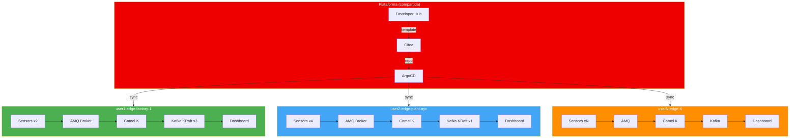

## De 1 instancia a N: el template como API de plataforma

El patrón Industrial Edge demuestra una arquitectura IoT validada: sensores → MQTT → Camel K → Kafka → Dashboard. Pero la versión desplegada es *fija* — un conjunto estático de namespaces creados por el administrador.

**El template `industrial-edge` convierte esa arquitectura validada en un servicio self-service.** Cualquier usuario puede desplegar instancias aisladas y completas desde Developer Hub, sin intervención manual.

### ¿Qué problema resuelve?

| Escenario | Sin template | Con template |
| --- | --- | --- |
| Nuevo equipo necesita un entorno IoT | Crear namespace, Kafka, RBAC, ArgoCD App manualmente (~1h) | Formulario en Developer Hub (~2 min) |
| Demo para 20 participantes | Coordinar con el admin para 20 namespaces | Cada participante ejecuta el template |
| Testing de integración Camel K | Modificar el entorno compartido (riesgo) | Instancia aislada descartable |
| Decommission | Borrar recursos manualmente, olvidar el catálogo | Template Remove Component (cascade) |

### Arquitectura del template

### Parámetros del formulario

| Campo | Tipo | Default | Descripción |
| --- | --- | --- | --- |
| Instance Name | string | `edge-factory-1` | Identificador único de la instancia |
| Description | string | `Industrial Edge IoT manufacturing line` | Descripción libre |
| User | string | (auto-detectado) | Username de OpenShift |
| Number of Machine Sensors | enum | `2` | 1, 2, 4 u 8 simuladores |
| Kafka Broker Replicas | enum | `3` | 1 (dev) o 3 (HA con KRaft) |
| Enable Anomaly Detection | boolean | `false` | Despliega ServingRuntime + InferenceService |
| Cluster Domain | string | (vacío) | Dominio de apps de OpenShift |

### Lo que se despliega

El template ejecuta 5 pasos en secuencia:

1. **Generate Skeleton** — Renderiza los manifiestos desde el directorio `skeleton/` sustituyendo variables
2. **Publish to Gitea** — Crea el repositorio `ws-<owner>/<name>` en Gitea
3. **Create ArgoCD Application** — Crea un CR `Application` en `openshift-gitops` vía la API de Kubernetes
4. **Register in Catalog** — Registra System + Components + APIs en Backstage
5. **Send Email Notification** — Envía confirmación por email vía Mailpit

### Componentes desplegados por instancia

Cada instancia incluye en su namespace:

| Recurso | Descripción |
| --- | --- |
| `<owner>-<name>-sensor-{1..N}` | Deployments de sensores Spring Boot (MQTT) |
| `broker-amq-ss-0` | ActiveMQ Artemis (MQTT broker) |
| `<owner>-<name>-cluster-broker-{0..2}` | Kafka brokers KRaft (Strimzi) |
| `mqtt2kafka-integration` | Camel K Integration (MQTT→Kafka) |
| `line-dashboard` | Dashboard web con Route público |
| `IntegrationPlatform` | Configuración Camel K con S2I |
| `KafkaTopics` | `iot-sensor-sw-vibration`, `iot-sensor-sw-temperature` |
| RBAC | ClusterRoleBinding para image-builder y camel-k-operator |

### Decisiones técnicas clave

- **K8s API proxy en vez de ArgoCD API** — Las Applications se crean como CRDs de Kubernetes a través del proxy `/k8s-api` existente. El ServiceAccount de Developer Hub ya tiene permisos `create`/`delete` sobre `argoproj.io/applications`. Esto elimina la necesidad de tokens ArgoCD dedicados.

- **ApplicationSet exclusion** — Los repos que contienen `argocd/application.yaml` son excluidos del ApplicationSet global (`pathsDoNotExist` filter) para evitar duplicación de Applications.

- **S2I para Camel K** — El `IntegrationPlatform` usa `publishStrategy: S2I` en lugar de Jib para aprovechar los builds nativos de OpenShift sin necesidad de credenciales explícitas al registry interno.

- **Probe tuning para Spring Boot** — Los sensores tienen `livenessProbe.initialDelaySeconds: 60s` y `readinessProbe.initialDelaySeconds: 30s` con `failureThreshold: 5` para acomodar el startup lento de la JVM.

- **Explicit Camel K dependencies** — La Integration declara `spec.dependencies: ["camel:kafka", "camel:paho"]` explícitamente en lugar de depender de magic comments en el source code embebido.

### Cleanup: el template Remove Component

Para eliminar una instancia, ejecutar el template **Remove Component (Cleanup)** en Developer Hub:

1. Seleccionar tipo: *Industrial Edge*
2. Ingresar nombre de la instancia y owner
3. El template ejecuta:
   - `DELETE` del repositorio en Gitea
   - `DELETE` del ArgoCD Application (cascade → borra namespace y todos los recursos)
   - Cleanup de todas las entidades del catálogo (System + 5 Components + 2 APIs)
   - Notificación email de decommission

### Dimensionamiento

| Factor | Valor por instancia (3-node Kafka) | Valor por instancia (1-node Kafka) |
| --- | --- | --- |
| vCPU | ~2.5 vCPU | ~1.2 vCPU |
| RAM | ~5 GiB | ~2.5 GiB |
| PVCs | 3 x Kafka + 1 AMQ = 4 | 1 x Kafka + 1 AMQ = 2 |
| Pods | ~8-10 | ~5-6 |

Para un worker pool de 48 vCPU / 192 GiB, se pueden ejecutar ~15-20 instancias con Kafka 3-node, o ~30-35 instancias con Kafka 1-node.
