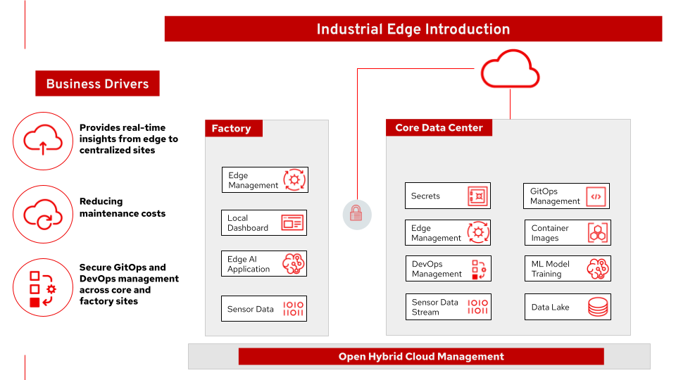
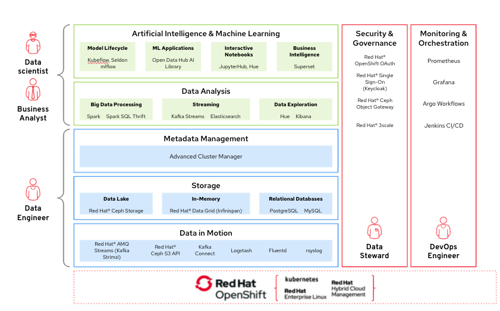
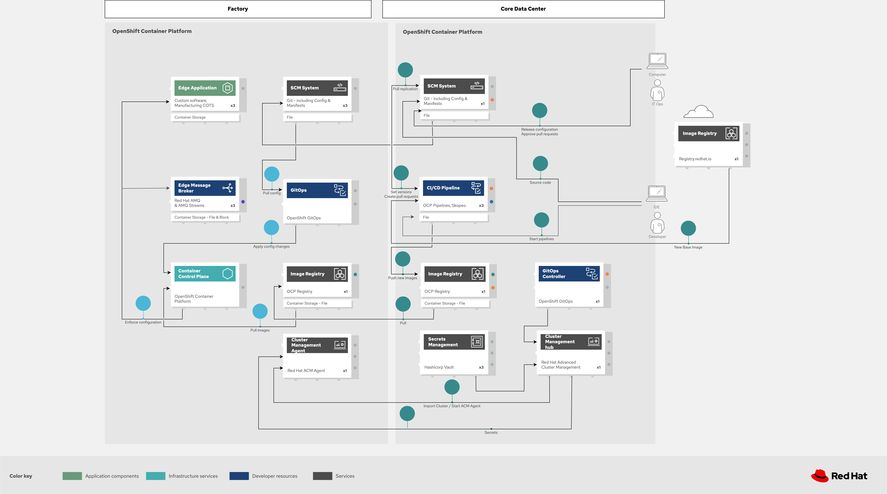
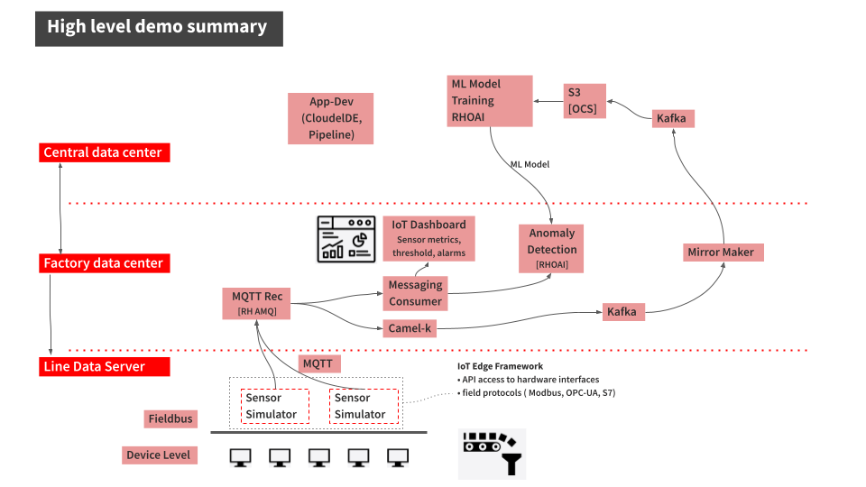

# Architecture

## Solution overview

*Figure 1. Industrial Edge solution overview for smart manufacturing.*

## AI/ML Architecture

*Figure 2. Mapping of organizational roles to architecture areas (core datacenter vs factories).*

## Data flow diagram

*Figure 3. Main data flows: northbound (sensors -> datacenter) and southbound (models/config -> edge).*

## Logical architecture

*Figure 4. Logical view of Industrial Edge deployed across multiple sites.*

## Messaging and ML components

*Figure 5. Data interaction between components: MQTT sensors, Kafka, Camel K, data lake, and ML inference.*

## GitOps

*Figure 6. GitOps workflows for managing changes across clusters and applications.*

## Demo scenario

*Figure 7. Demo scenario summary — machine condition monitoring based on IoT sensor data with AI/ML.*

## IoT data flow

1. **Machine Sensors** publish vibration and temperature readings every second via **MQTT**
2. **AMQ Broker** receives MQTT messages on topics `iot-sensor/sw/vibration` and `iot-sensor/sw/temperature`
3. **Camel K (MQTT->Kafka)** bridge consumes from MQTT and produces to **Kafka** topics `iot-sensor-sw-vibration` and `iot-sensor-sw-temperature`
4. **Line Dashboard** consumes directly from MQTT via WebSocket for real-time visualization
5. **IoT Consumer** processes data and optionally invokes **ModelMesh** for anomaly detection
6. **Camel K (Kafka->S3)** archives Kafka events to **MinIO S3** as a data lake
7. **OpenShift AI** uses data lake contents to train anomaly detection models
8. Trained models are deployed to **ModelMesh** for real-time inference

## CDC (Change Data Capture) flow

1. Applications (e.g. Neuralbank) write to **PostgreSQL**
2. **Debezium** (KafkaConnect) captures changes from PostgreSQL WAL
3. CDC events are published to **Kafka cdc-cluster** on topics like `<server>.<schema>.<table>`
4. Consumers (Camel K, FUSE, etc.) process events for view materialization, notifications, etc.

## Namespaces and ArgoCD Apps

| ArgoCD Application | Namespace(s) | Contents |
|---------------------|-------------|----------|
| `field-content-industrial-edge-tst` | `industrial-edge-tst-all` | Full dev environment |
| `field-content-industrial-edge-stormshift` | `industrial-edge-stormshift-*` | Factory edge |
| `field-content-industrial-edge-data-lake` | `industrial-edge-data-lake` | Kafka prod + Camel K->S3 |
| `field-content-industrial-edge-minio` | `industrial-edge-ml-workspace` | MinIO S3 storage |
| `field-content-industrial-edge-data-science-project` | `ml-development` | OpenShift AI workloads |
| `field-content-industrial-edge-data-science-cluster` | cluster-scoped | RHODS DataScienceCluster |
| `field-content-industrial-edge-pipelines` | `industrial-edge-pipelines` | Tekton pipelines |
