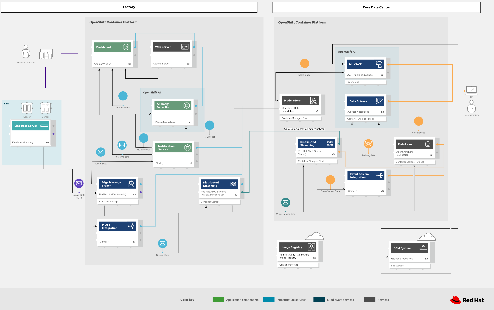

# Component 1 — CDC for Applications (HA Sizing)

## Description

Change Data Capture (CDC) with Debezium captures changes from relational databases (PostgreSQL, MySQL, SQL Server) and publishes them as events to Kafka. This enables patterns such as event sourcing, view materialization, microservice synchronization, and real-time auditing.

## CDC Architecture

[](images/edge-mfg-messaging-ml.png)

*Data flow architecture: PostgreSQL databases feed Debezium (KafkaConnect) which captures changes via WAL replication and publishes them to the Kafka CDC Cluster. Consumers (Camel K, custom applications) process CDC events for view materialization, notifications, and indexing.*

## HA Sizing — Minimum production (3 nodes)

### Kafka Cluster (CDC)

| Parameter | Dev/Demo | HA Production (min. 3 nodes) | HA Production (high volume) | Production (20K devices) |
|-----------|----------|------------------------------|------------------------------|--------------------------|
| **Broker replicas** | 1 | 3 | 5 | 5 (KRaft broker+controller) |
| **CPU request/limit** | 250m / 500m | 1000m / 2000m | 2000m / 4000m | 2000m / 4000m |
| **Memory request/limit** | 512Mi / 1Gi | 2Gi / 4Gi | 4Gi / 8Gi | 4Gi / 8Gi |
| **Storage (per broker)** | 5Gi | 50Gi (SSD/gp3) | 200Gi (SSD/gp3) | 200Gi (SSD/gp3) |
| **StorageClass** | gp3-csi | gp3-csi (io1 for high IOPS) | io1/io2 | io1/io2 |
| **JVM Heap (-Xms/-Xmx)** | 256m | 1536m | 3072m | 3072m |
| **ZooKeeper replicas** | 1 | 3 | 3 | — (KRaft mode) |
| **ZK CPU** | 200m / 400m | 500m / 1000m | 500m / 1000m | — (KRaft mode) |
| **ZK Memory** | 256Mi / 512Mi | 1Gi / 2Gi | 1Gi / 2Gi | — (KRaft mode) |
| **ZK Storage** | 5Gi | 20Gi | 50Gi | — (KRaft mode) |
| **`min.insync.replicas`** | 1 | 2 | 2 | 2 |
| **`default.replication.factor`** | 1 | 3 | 3 | 3 |
| **`num.partitions`** | 1 | 3 | 12 | 12 |
| **`log.retention.hours`** | 168 (7d) | 720 (30d) | 2160 (90d) | 2160 (90d) |
| **Total nodes (cluster)** | 1 worker | 3+ workers (anti-affinity) | 5+ workers | 5 (KRaft, no ZK needed) |

### Debezium KafkaConnect

| Parameter | Dev/Demo | HA Production (small) | Production (20K devices) |
|-----------|----------|----------------------|--------------------------|
| **Replicas** | 1 | 2-3 | 3 |
| **CPU request/limit** | 250m / 500m | 500m / 2000m | 1000m / 4000m |
| **Memory request/limit** | 512Mi / 1Gi | 1Gi / 2Gi | 2Gi / 4Gi |
| **`max.tasks`** | 1 | 1 per connector (Debezium requires exactly 1 task per source) | 1 per connector |
| **Heartbeat interval** | — | 10000ms (fast failover detection) | 10000ms |
| **`snapshot.mode`** | initial | initial (first time), then schema_only | schema_only |

### HA Resource summary (CDC) — HA Production (small)

| Component | Pods | Total CPU (req/lim) | Total Memory (req/lim) | Storage |
|-----------|------|---------------------|----------------------|---------|
| Kafka brokers | 3 | 3000m / 6000m | 6Gi / 12Gi | 150Gi |
| ZooKeeper | 3 | 1500m / 3000m | 3Gi / 6Gi | 60Gi |
| KafkaConnect (Debezium) | 2 | 1000m / 4000m | 2Gi / 4Gi | — |
| **TOTAL CDC** | **8** | **5500m / 13000m** | **11Gi / 22Gi** | **210Gi** |

### Production (20K devices) — Resource summary

20K devices drive ~5,000 DB transactions/sec. Average CDC event: ~1 KB (before/after snapshots). Producer rate: **5 MB/sec**.

**Producer side (Debezium -> Kafka):**

| Component | Pods | Total CPU (req/lim) | Total Memory (req/lim) | Storage |
|-----------|------|---------------------|----------------------|---------|
| Kafka CDC (5 KRaft) | 5 | 10000m / 20000m | 20Gi / 40Gi | 1000Gi |
| KafkaConnect (Debezium) | 3 | 3000m / 12000m | 6Gi / 12Gi | — |
| **Producer subtotal** | **8** | **13000m / 32000m** | **26Gi / 52Gi** | **1000Gi** |

**Consumer side (5 consumer groups, ~25K reads/sec, ~25 MB/sec egress):**

| Consumer application | Pods | CPU (req/lim) | Memory (req/lim) | Purpose |
|---------------------|------|---------------|------------------|---------|
| Camel K (view materialization) | 3 | 1500m / 3000m | 1.5Gi / 3Gi | Materializes views from CDC events |
| Notification service | 2 | 500m / 1000m | 512Mi / 1Gi | Sends alerts on specific changes |
| Search indexer | 3 | 3000m / 6000m | 3Gi / 6Gi | Indexes CDC events for full-text search |
| Analytics pipeline | 2 | 1000m / 2000m | 2Gi / 4Gi | Aggregates CDC events for reporting |
| Audit logger | 2 | 500m / 1000m | 1Gi / 2Gi | Immutable audit trail |
| **Consumer subtotal** | **12** | **6500m / 13000m** | **8Gi / 16Gi** | — |

5 consumer groups = 5x read amplification on brokers. This requires ~15% more CPU/memory for fetch requests, already factored into the 5-node KRaft sizing above.

**Total CDC (20K with consumers):**

| | Pods | vCPU (req) | Memory (req) | Storage |
|--|------|-----------|-------------|---------|
| **Producer** | 8 | 13.0 | 26Gi | 1000Gi |
| **Consumer** | 12 | 6.5 | 8Gi | — |
| **TOTAL CDC (20K)** | **20** | **19.5 vCPU** | **34Gi** | **1000Gi** |

## Recommended HA configuration (small)

```yaml
apiVersion: kafka.strimzi.io/v1beta2
kind: Kafka
metadata:
  name: cdc-cluster
spec:
  kafka:
    version: 3.7.0
    replicas: 3
    listeners:
      - name: plain
        port: 9092
        type: internal
        tls: false
      - name: tls
        port: 9093
        type: internal
        tls: true
    config:
      offsets.topic.replication.factor: 3
      transaction.state.log.replication.factor: 3
      transaction.state.log.min.isr: 2
      default.replication.factor: 3
      min.insync.replicas: 2
      num.partitions: 3
      log.retention.hours: 720
      log.segment.bytes: 1073741824
      auto.create.topics.enable: false
    storage:
      type: jbod
      volumes:
        - id: 0
          type: persistent-claim
          size: 50Gi
          class: gp3-csi
          deleteClaim: false
    resources:
      requests:
        cpu: "1"
        memory: 2Gi
      limits:
        cpu: "2"
        memory: 4Gi
    jvmOptions:
      -Xms: 1536m
      -Xmx: 1536m
    template:
      pod:
        affinity:
          podAntiAffinity:
            requiredDuringSchedulingIgnoredDuringExecution:
              - labelSelector:
                  matchLabels:
                    strimzi.io/name: cdc-cluster-kafka
                topologyKey: kubernetes.io/hostname
    metricsConfig:
      type: jmxPrometheusExporter
      valueFrom:
        configMapKeyRef:
          name: kafka-metrics
          key: kafka-metrics-config.yml
  zookeeper:
    replicas: 3
    storage:
      type: persistent-claim
      size: 20Gi
      class: gp3-csi
      deleteClaim: false
    resources:
      requests:
        cpu: "500m"
        memory: 1Gi
      limits:
        cpu: "1"
        memory: 2Gi
    template:
      pod:
        affinity:
          podAntiAffinity:
            requiredDuringSchedulingIgnoredDuringExecution:
              - labelSelector:
                  matchLabels:
                    strimzi.io/name: cdc-cluster-zookeeper
                topologyKey: kubernetes.io/hostname
  entityOperator:
    topicOperator:
      resources:
        requests:
          cpu: 100m
          memory: 256Mi
    userOperator:
      resources:
        requests:
          cpu: 100m
          memory: 256Mi
---
apiVersion: kafka.strimzi.io/v1beta2
kind: KafkaConnect
metadata:
  name: debezium-connect
  annotations:
    strimzi.io/use-connector-resources: "true"
spec:
  version: 3.7.0
  replicas: 2
  bootstrapServers: cdc-cluster-kafka-bootstrap:9092
  resources:
    requests:
      cpu: "500m"
      memory: 1Gi
    limits:
      cpu: "2"
      memory: 2Gi
  config:
    group.id: debezium-connect
    offset.storage.topic: debezium-connect-offsets
    offset.storage.replication.factor: 3
    config.storage.topic: debezium-connect-configs
    config.storage.replication.factor: 3
    status.storage.topic: debezium-connect-status
    status.storage.replication.factor: 3
    key.converter: org.apache.kafka.connect.json.JsonConverter
    value.converter: org.apache.kafka.connect.json.JsonConverter
  build:
    output:
      type: imagestream
      image: debezium-connect:latest
    plugins:
      - name: debezium-postgresql
        artifacts:
          - type: maven
            group: io.debezium
            artifact: debezium-connector-postgres
            version: 2.5.4.Final
```

## Production 20K configuration (KRaft)

```yaml
apiVersion: kafka.strimzi.io/v1beta2
kind: Kafka
metadata:
  name: cdc-cluster
  annotations:
    strimzi.io/kraft: enabled
    strimzi.io/node-pools: enabled
spec:
  kafka:
    version: 3.7.0
    listeners:
      - name: plain
        port: 9092
        type: internal
        tls: false
      - name: tls
        port: 9093
        type: internal
        tls: true
    config:
      offsets.topic.replication.factor: 3
      transaction.state.log.replication.factor: 3
      transaction.state.log.min.isr: 2
      default.replication.factor: 3
      min.insync.replicas: 2
      num.partitions: 12
      log.retention.hours: 2160
      log.segment.bytes: 1073741824
      auto.create.topics.enable: false
    metricsConfig:
      type: jmxPrometheusExporter
      valueFrom:
        configMapKeyRef:
          name: kafka-metrics
          key: kafka-metrics-config.yml
  entityOperator:
    topicOperator:
      resources:
        requests:
          cpu: 100m
          memory: 256Mi
    userOperator:
      resources:
        requests:
          cpu: 100m
          memory: 256Mi
---
apiVersion: kafka.strimzi.io/v1beta2
kind: KafkaNodePool
metadata:
  name: combined
  labels:
    strimzi.io/cluster: cdc-cluster
spec:
  replicas: 5
  roles:
    - controller
    - broker
  storage:
    type: jbod
    volumes:
      - id: 0
        type: persistent-claim
        size: 200Gi
        class: gp3-csi
        deleteClaim: false
  resources:
    requests:
      cpu: "2"
      memory: 4Gi
    limits:
      cpu: "4"
      memory: 8Gi
  jvmOptions:
    -Xms: 3072m
    -Xmx: 3072m
  template:
    pod:
      affinity:
        podAntiAffinity:
          requiredDuringSchedulingIgnoredDuringExecution:
            - labelSelector:
                matchLabels:
                  strimzi.io/name: cdc-cluster-kafka
              topologyKey: kubernetes.io/hostname
---
apiVersion: kafka.strimzi.io/v1beta2
kind: KafkaConnect
metadata:
  name: debezium-connect
  annotations:
    strimzi.io/use-connector-resources: "true"
spec:
  version: 3.7.0
  replicas: 3
  bootstrapServers: cdc-cluster-kafka-bootstrap:9092
  resources:
    requests:
      cpu: "1"
      memory: 2Gi
    limits:
      cpu: "4"
      memory: 4Gi
  config:
    group.id: debezium-connect
    offset.storage.topic: debezium-connect-offsets
    offset.storage.replication.factor: 3
    config.storage.topic: debezium-connect-configs
    config.storage.replication.factor: 3
    status.storage.topic: debezium-connect-status
    status.storage.replication.factor: 3
    key.converter: org.apache.kafka.connect.json.JsonConverter
    value.converter: org.apache.kafka.connect.json.JsonConverter
  build:
    output:
      type: imagestream
      image: debezium-connect:latest
    plugins:
      - name: debezium-postgresql
        artifacts:
          - type: maven
            group: io.debezium
            artifact: debezium-connector-postgres
            version: 2.5.4.Final
```

## Operational considerations

### Monitoring

- **Kafka Lag**: monitor `kafka_consumergroup_lag` to detect CDC processing delays
- **Debezium Metrics**: `debezium_metrics_MilliSecondsSinceLastEvent` — investigate if it exceeds 60s
- **Disk usage**: alert at 70% of Kafka storage capacity

### Backup and DR

- Debezium offsets are stored in Kafka and automatically replicated with `replication.factor: 3`
- In case of total loss, Debezium can re-snapshot the database (`snapshot.mode: initial`)
- **KafkaMirrorMaker2** is recommended for replicating CDC topics to a DR cluster (see [Component 3 — Mirror](mirror-plan.md))

### Scaling

- Kafka brokers: add brokers and redistribute partitions with `kafka-reassign-partitions.sh`
- Debezium: DO NOT scale tasks (Debezium PostgreSQL requires exactly 1 task per connector), but additional connectors can be added for more databases
- For high throughput (>10K events/sec), consider dedicated partitions and compaction
