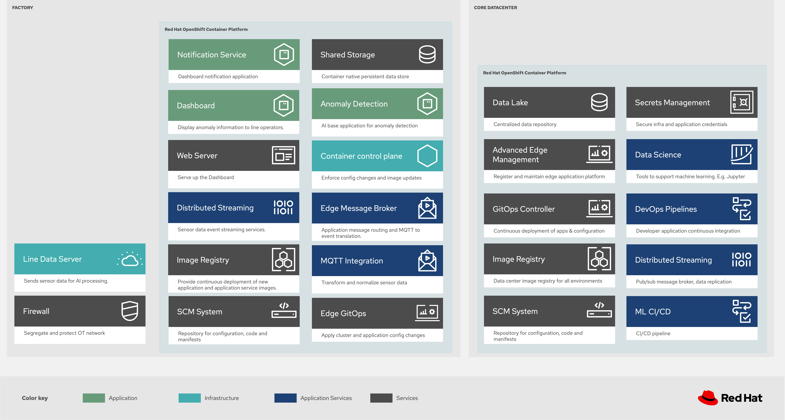

# Component 2 — Industrial Edge IoT (HA Sizing)

## Description

The Industrial Edge IoT stack encompasses the complete manufacturing pipeline: simulated machine sensors, MQTT broker, Kafka event streaming, Camel K integration, real-time dashboards, and ML anomaly detection. This component operates across multiple namespaces replicating the edge-to-datacenter architecture.

## Layered architecture

[](images/industrial-edge-logical.png)

*Layer 1 (Edge/Factory): Sensors -> AMQ Broker -> Camel K -> Kafka -> Dashboard + IoT Consumer. Layer 2 (Datacenter): Kafka data-lake -> Camel K -> S3 -> OpenShift AI -> ModelMesh (anomaly detection).*

## HA Sizing — Minimum production (3 nodes)

### AMQ Broker (MQTT)

| Parameter | Dev/Demo | HA Production (small) | Production (20K devices) |
|-----------|----------|----------------------|--------------------------|
| **Replicas** | 1 | 2 (active/passive with shared storage) | 4 (active/active mesh) |
| **CPU request/limit** | 250m / 500m | 500m / 1000m | 2000m / 4000m |
| **Memory request/limit** | 256Mi / 512Mi | 1Gi / 2Gi | 4Gi / 8Gi |
| **Storage** | 2Gi | 10Gi (persistent, RWO) | 20Gi (persistent, RWO) |
| **Acceptors** | all:61616 | MQTT:1883, AMQP:5672, CORE:61616 | MQTT:1883, AMQP:5672, CORE:61616 |
| **Clustering** | No | HA pair with `ha-policy: shared-store` | HA mesh with 4 brokers |
| **Max connections** | 100 | 10000 | 20000 |
| **Journal type** | NIO | AIO (if OS supports it) | AIO |

### Kafka Clusters (IoT)

Up to **3 separate Kafka clusters** are required (dev, factory, data-lake):

| Parameter | Dev/Demo (each) | HA Production (small, each) | Production (20K, each) |
|-----------|----------------|---------------------------|------------------------|
| **Broker replicas** | 1 | 3 | 5 (KRaft broker+controller) |
| **CPU request/limit** | 250m / 500m | 1000m / 2000m | 4000m / 8000m |
| **Memory request/limit** | 512Mi / 1Gi | 2Gi / 4Gi | 8Gi / 16Gi |
| **Storage (per broker)** | 5Gi | 50Gi (SSD) | 500Gi (SSD) |
| **JVM Heap** | 256m | 1536m | 6144m |
| **ZooKeeper replicas** | 1 | 3 | — (KRaft mode) |
| **ZK CPU** | 200m / 400m | 500m / 1000m | — (KRaft mode) |
| **ZK Memory** | 256Mi / 512Mi | 1Gi / 2Gi | — (KRaft mode) |
| **ZK Storage** | 5Gi | 20Gi | — (KRaft mode) |
| **`min.insync.replicas`** | 1 | 2 | 2 |
| **`default.replication.factor`** | 1 | 3 | 3 |
| **Topics** | 2 (vibration, temperature) | 2+ per production line | 2+ per line, 24 partitions each |

### Camel K Integrations

| Parameter | Dev/Demo | HA Production (small) | Production (20K devices) |
|-----------|----------|----------------------|--------------------------|
| **MQTT->Kafka replicas** | 1 | 2 | 4 |
| **Kafka->S3 replicas** | 1 | 2 | 4 |
| **CPU request/limit** | 250m / 500m | 500m / 1000m | 1000m / 2000m |
| **Memory request/limit** | 256Mi / 512Mi | 512Mi / 1Gi | 1Gi / 2Gi |
| **IntegrationPlatform maxRunningBuilds** | 1 | 3 | 5 |
| **Base image** | ubi9/openjdk-17-runtime | ubi9/openjdk-17-runtime | ubi9/openjdk-17-runtime |

### Machine Sensors

| Parameter | Dev/Demo | HA Production (small) | Production (20K devices) |
|-----------|----------|----------------------|--------------------------|
| **Replicas per sensor** | 1 | 1 (no HA needed, they are generators) | 1 |
| **Number of sensors** | 2 | N (per production line) | 10 (edge gateways, each aggregating 2,000 devices) |
| **CPU** | 50m / 100m | 100m / 200m | 500m / 1000m |
| **Memory** | 64Mi / 128Mi | 128Mi / 256Mi | 512Mi / 1Gi |
| **Publish interval** | 1000ms | Configurable (100ms-5000ms) | Configurable (100ms-5000ms) |

### Line Dashboard

| Parameter | Dev/Demo | HA Production (small) | Production (20K devices) |
|-----------|----------|----------------------|--------------------------|
| **Replicas** | 1 | 2 | 2 (HPA up to 4) |
| **CPU** | 100m / 200m | 200m / 500m | 1000m / 2000m |
| **Memory** | 128Mi / 256Mi | 256Mi / 512Mi | 1Gi / 2Gi |
| **WebSocket connections** | 10 | 500+ (with HPA) | 2000+ (with HPA) |

### OpenShift AI (ML)

| Parameter | Dev/Demo | HA Production (small) | Production (20K devices) |
|-----------|----------|----------------------|--------------------------|
| **JupyterLab** | 1 notebook (Small) | Medium/Large (4+ CPU, 8+ GB RAM) | Large (8+ CPU, 16+ GB RAM) |
| **ModelMesh replicas** | 1 | 2-3 | 5 |
| **ModelMesh CPU** | 250m / 500m | 500m / 2000m | 2000m / 4000m |
| **ModelMesh Memory** | 512Mi / 1Gi | 1Gi / 4Gi | 4Gi / 8Gi |
| **DSPA replicas** | 1 | 2 | 3 |
| **MinIO storage** | 10Gi | 100Gi+ (depending on data volume) | 1.5Ti x 8 nodes (see MinIO section) |
| **GPU** | — | 1x NVIDIA T4/A10G (optional for deep learning) | 1x NVIDIA A10G (dedicated node) |

### MinIO S3

| Parameter | Dev/Demo | HA Production (small) | Production (20K devices) |
|-----------|----------|----------------------|--------------------------|
| **Mode** | Standalone (1 pod) | Distributed (4+ pods, erasure coding) | Distributed (8 pods, erasure coding) |
| **Replicas** | 1 | 4 (minimum for erasure coding) | 8 |
| **CPU** | 250m / 500m | 1000m / 2000m | 2000m / 4000m |
| **Memory** | 256Mi / 512Mi | 2Gi / 4Gi | 4Gi / 8Gi |
| **Storage per node** | 10Gi | 100Gi-500Gi (SSD) | 1.5Ti (SSD) |
| **Erasure coding** | — | EC:2 (tolerates 2 failed disks/pods) | EC:2 (tolerates 2 failed disks/pods) |

## Total resource summary

### HA Production (small) — per environment (factory or dev)

| Component | Pods | CPU (req/lim) | Memory (req/lim) | Storage |
|-----------|------|---------------|------------------|---------|
| AMQ Broker | 2 | 1000m / 2000m | 2Gi / 4Gi | 20Gi |
| Kafka (3 brokers) | 3 | 3000m / 6000m | 6Gi / 12Gi | 150Gi |
| ZooKeeper | 3 | 1500m / 3000m | 3Gi / 6Gi | 60Gi |
| Camel K (2 integrations) | 4 | 2000m / 4000m | 2Gi / 4Gi | — |
| Sensors | 2 | 200m / 400m | 256Mi / 512Mi | — |
| Dashboard | 2 | 400m / 1000m | 512Mi / 1Gi | — |
| **Edge env subtotal** | **16** | **8100m / 16400m** | **14Gi / 28Gi** | **230Gi** |

### HA Production (small) — Central components (shared)

| Component | Pods | CPU (req/lim) | Memory (req/lim) | Storage |
|-----------|------|---------------|------------------|---------|
| Kafka data-lake | 3+3 ZK | 4500m / 9000m | 9Gi / 18Gi | 210Gi |
| Camel K -> S3 | 2 | 1000m / 2000m | 1Gi / 2Gi | — |
| MinIO (distributed) | 4 | 4000m / 8000m | 8Gi / 16Gi | 400Gi |
| ModelMesh | 3 | 1500m / 6000m | 3Gi / 12Gi | — |
| DSPA | 2 | 500m / 1000m | 1Gi / 2Gi | — |
| JupyterLab | 1 | 2000m / 4000m | 4Gi / 8Gi | 20Gi |
| **Central subtotal** | **18** | **13500m / 30000m** | **26Gi / 58Gi** | **630Gi** |

### HA Production (small) — Total (2 edge environments + central)

| | Pods | vCPU (req) | Memory (req) | Storage |
|--|------|-----------|-------------|---------|
| **Factory edge** | 16 | 8.1 | 14Gi | 230Gi |
| **Dev/test edge** | 16 | 8.1 | 14Gi | 230Gi |
| **Central** | 18 | 13.5 | 26Gi | 630Gi |
| **TOTAL** | **50** | **29.7 vCPU** | **54Gi** | **1090Gi** |

### Production (20K devices) — Factory edge

| Component | Pods | CPU (req/lim) | Memory (req/lim) | Storage |
|-----------|------|---------------|------------------|---------|
| AMQ Broker (mesh) | 4 | 8000m / 16000m | 16Gi / 32Gi | 80Gi |
| Kafka (5 KRaft nodes) | 5 | 20000m / 40000m | 40Gi / 80Gi | 2500Gi |
| Camel K (MQTT->Kafka) | 4 | 4000m / 8000m | 4Gi / 8Gi | — |
| Sensors (edge gateways) | 10 | 5000m / 10000m | 5Gi / 10Gi | — |
| Dashboard (HPA) | 2 | 2000m / 4000m | 2Gi / 4Gi | — |
| **Edge subtotal** | **25** | **39000m / 78000m** | **67Gi / 134Gi** | **2580Gi** |

### Production (20K devices) — Central components

| Component | Pods | CPU (req/lim) | Memory (req/lim) | Storage |
|-----------|------|---------------|------------------|---------|
| Kafka data-lake (5 KRaft) | 5 | 20000m / 40000m | 40Gi / 80Gi | 2500Gi |
| Camel K -> S3 | 4 | 4000m / 8000m | 4Gi / 8Gi | — |
| MinIO (8 distributed) | 8 | 16000m / 32000m | 32Gi / 64Gi | 12288Gi |
| ModelMesh | 5 | 10000m / 20000m | 20Gi / 40Gi | — |
| DSPA + pipelines | 3 | 4500m / 9000m | 9Gi / 18Gi | — |
| JupyterLab | 1 | 4000m / 8000m | 8Gi / 16Gi | 20Gi |
| Operators & monitoring | 3 | 9000m / 18000m | 18Gi / 36Gi | — |
| **Central subtotal** | **29** | **67500m / 135000m** | **131Gi / 262Gi** | **14808Gi** |

### Production (20K devices) — Total (factory edge + dev/test + central)

| | Pods | vCPU (req) | Memory (req) | Storage |
|--|------|-----------|-------------|---------|
| **Factory edge (20K)** | 25 | 39.0 | 67Gi | 2580Gi |
| **Dev/test edge (small HA)** | 16 | 8.1 | 14Gi | 230Gi |
| **Central (20K)** | 29 | 67.5 | 131Gi | 14808Gi |
| **TOTAL** | **70** | **114.6 vCPU** | **212Gi** | **17618Gi (~17.2 TiB)** |

## Recommended OpenShift nodes

| Profile | Workers | vCPU | RAM | Notes |
|---------|---------|------|-----|-------|
| **Demo/PoC** | 3 | 12 | 48Gi | All single-replica mode |
| **Minimum HA** | 5 | 40 | 160Gi | Anti-affinity for Kafka/ZK |
| **Production HA (small)** | 7+ | 112+ | 448Gi+ | Separate edge/central with taints |
| **With GPU (ML)** | +1 | +4 | +16Gi + GPU | Dedicated node for training |
| **Production 20K** | 19 (2 clusters) | 280 | 1152Gi | Hub (12+1 GPU) + Edge (5), KRaft |
| **Enterprise 20K** | 25 (4 clusters) | 376 | 1472Gi | Hub + Edge + Data + DR, KRaft |

## Key HA configuration (small)

```yaml
apiVersion: kafka.strimzi.io/v1beta2
kind: Kafka
metadata:
  name: factory-cluster
spec:
  kafka:
    replicas: 3
    config:
      default.replication.factor: 3
      min.insync.replicas: 2
      offsets.topic.replication.factor: 3
      transaction.state.log.replication.factor: 3
      transaction.state.log.min.isr: 2
    storage:
      type: jbod
      volumes:
        - id: 0
          type: persistent-claim
          size: 50Gi
          class: gp3-csi
          deleteClaim: false
    resources:
      requests:
        cpu: "1"
        memory: 2Gi
      limits:
        cpu: "2"
        memory: 4Gi
    template:
      pod:
        affinity:
          podAntiAffinity:
            requiredDuringSchedulingIgnoredDuringExecution:
              - labelSelector:
                  matchLabels:
                    strimzi.io/name: factory-cluster-kafka
                topologyKey: kubernetes.io/hostname
  zookeeper:
    replicas: 3
    storage:
      type: persistent-claim
      size: 20Gi
      class: gp3-csi
    resources:
      requests:
        cpu: "500m"
        memory: 1Gi
    template:
      pod:
        affinity:
          podAntiAffinity:
            requiredDuringSchedulingIgnoredDuringExecution:
              - labelSelector:
                  matchLabels:
                    strimzi.io/name: factory-cluster-zookeeper
                topologyKey: kubernetes.io/hostname
```

## Production 20K configuration (KRaft)

```yaml
apiVersion: kafka.strimzi.io/v1beta2
kind: Kafka
metadata:
  name: factory-cluster
  annotations:
    strimzi.io/kraft: enabled
    strimzi.io/node-pools: enabled
spec:
  kafka:
    version: 3.7.0
    listeners:
      - name: plain
        port: 9092
        type: internal
        tls: false
      - name: tls
        port: 9093
        type: internal
        tls: true
    config:
      default.replication.factor: 3
      min.insync.replicas: 2
      offsets.topic.replication.factor: 3
      transaction.state.log.replication.factor: 3
      transaction.state.log.min.isr: 2
      num.partitions: 24
    metricsConfig:
      type: jmxPrometheusExporter
      valueFrom:
        configMapKeyRef:
          name: kafka-metrics
          key: kafka-metrics-config.yml
  entityOperator:
    topicOperator: {}
    userOperator: {}
---
apiVersion: kafka.strimzi.io/v1beta2
kind: KafkaNodePool
metadata:
  name: combined
  labels:
    strimzi.io/cluster: factory-cluster
spec:
  replicas: 5
  roles:
    - controller
    - broker
  storage:
    type: jbod
    volumes:
      - id: 0
        type: persistent-claim
        size: 500Gi
        class: gp3-csi
        deleteClaim: false
  resources:
    requests:
      cpu: "4"
      memory: 8Gi
    limits:
      cpu: "8"
      memory: 16Gi
  jvmOptions:
    -Xms: 6144m
    -Xmx: 6144m
  template:
    pod:
      affinity:
        podAntiAffinity:
          requiredDuringSchedulingIgnoredDuringExecution:
            - labelSelector:
                matchLabels:
                  strimzi.io/name: factory-cluster-kafka
              topologyKey: kubernetes.io/hostname
```

## Horizontal scaling

| Component | Scaling method |
|-----------|---------------|
| **Kafka** | Add brokers + redistribute partitions |
| **Sensors** | Add deployments (1 per production line) |
| **Camel K** | Increase replicas in the Integration CR |
| **Dashboard** | HPA based on WebSocket connections |
| **ModelMesh** | Increase replicas in InferenceService |
| **MinIO** | Add nodes to the erasure coding pool |
