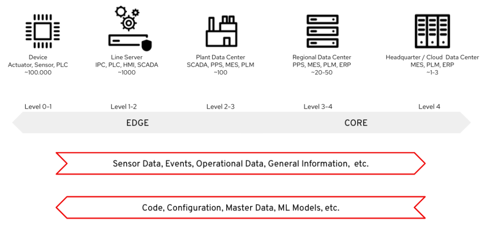

# Component 3 — Mirror/Replicas for External Queries (Plan)

## Objective

Create read replicas of **CDC** and **Industrial Edge** Kafka clusters using **KafkaMirrorMaker2** to allow external queries without impacting production clusters. This enables:

- Analytics/BI consumers reading data without affecting production latency
- Geographic replication for teams in other regions
- Disaster recovery (DR) cluster with up-to-date data
- Secure external access (TLS + SASL) without exposing internal clusters

## Proposed architecture

[](images/edge-mfg-data-flow.png)

*Source clusters (cdc-cluster, factory-cluster, dev-cluster) feed KafkaMirrorMaker2 which replicates topics to a read-only Kafka Mirror Cluster in the `kafka-mirror` namespace.*

### Replication flow detail

| Source cluster | Namespace | Topics | Mirror prefix |
|----------------|-----------|--------|---------------|
| `cdc-cluster` | `kafka-cdc` | `dbserver.*` | `cdc.*` |
| `factory-cluster` | `industrial-edge-stormshift-messaging` | `iot-sensor-sw-*` | `factory.*` |
| `dev-cluster` | `industrial-edge-tst-all` | `iot-sensor-sw-*` | `dev.*` |

### Mirror Cluster (read-only)

| Property | Value |
|----------|-------|
| **Namespace** | `kafka-mirror` |
| **Brokers** | 3 (HA) |
| **Storage** | 100Gi x 3 = 300Gi |
| **Listeners** | internal (plain:9092), tls (9093), external route (443, TLS + SCRAM-SHA-512) |
| **Consumers** | Analytics/BI (Grafana, Superset), External consumers (partners, data science, DR) |

## Implementation plan

### Phase 1: Infrastructure (Week 1)

1. **Create `kafka-mirror` namespace**
2. **Deploy Kafka mirror-cluster** (3 brokers, 3 ZooKeeper)
3. **Configure listeners**: plain (internal), TLS (internal), external route (TLS + SCRAM-SHA-512)
4. **Create KafkaUser** for external access with read-only ACLs
5. **Create ArgoCD Application** `field-content-industrial-edge-mirror`

### Phase 2: CDC Replication (Week 2)

1. **Deploy KafkaMirrorMaker2** with source `cdc-cluster`
2. **Configure topicsPattern**: `dbserver\..*` (all CDC topics)
3. **Validate replication**: compare offsets source vs mirror
4. **Configure monitoring**: lag metrics between source and mirror

### Phase 3: Industrial Edge Replication (Week 2-3)

1. **Add sources** `factory-cluster` and `dev-cluster` to MirrorMaker2
2. **Configure topicsPattern**: `iot-sensor-sw-.*`
3. **Validate data**: consume from mirror and compare with source
4. **Configure different retention**: mirror with extended retention (90 days) for analytics

### Phase 4: External Access (Week 3-4)

1. **Configure TLS certificates** (Let's Encrypt or cert-manager)
2. **Create KafkaUsers** with SCRAM-SHA-512 and restrictive ACLs
3. **Document endpoints** for analytics teams
4. **Configure NetworkPolicy** to restrict access
5. **Create monitoring dashboard** in Grafana

## HA Sizing — Mirror Cluster

### Kafka Mirror Cluster

| Parameter | Dev/Demo | HA Production (small) | Production (20K devices) |
|-----------|----------|----------------------|--------------------------|
| **Broker replicas** | 1 | 3 | 5 (KRaft broker+controller) |
| **CPU request/limit** | 250m / 500m | 1000m / 2000m | 2000m / 4000m |
| **Memory request/limit** | 512Mi / 1Gi | 2Gi / 4Gi | 4Gi / 8Gi |
| **Storage (per broker)** | 10Gi | 100Gi (SSD) | 500Gi (SSD) |
| **JVM Heap** | 256m | 1536m | 3072m |
| **ZooKeeper replicas** | 1 | 3 | — (KRaft mode) |
| **ZK CPU** | 200m / 400m | 500m / 1000m | — (KRaft mode) |
| **ZK Memory** | 256Mi / 512Mi | 1Gi / 2Gi | — (KRaft mode) |
| **ZK Storage** | 5Gi | 20Gi | — (KRaft mode) |
| **`default.replication.factor`** | 1 | 3 | 3 |
| **`min.insync.replicas`** | 1 | 2 | 2 |
| **`log.retention.hours`** | 168 (7d) | 2160 (90d) | 2160 (90d) |

### KafkaMirrorMaker2

| Parameter | Dev/Demo | HA Production (small) | Production (20K devices) |
|-----------|----------|----------------------|--------------------------|
| **Replicas** | 1 | 3 | 5 |
| **CPU request/limit** | 250m / 500m | 500m / 1000m | 1000m / 2000m |
| **Memory request/limit** | 512Mi / 1Gi | 1Gi / 2Gi | 2Gi / 4Gi |
| **`refresh.topics.interval.seconds`** | 600 | 30 | 30 |
| **`sync.group.offsets.enabled`** | true | true | true |
| **`sync.group.offsets.interval.seconds`** | 60 | 10 | 10 |
| **`emit.heartbeats.enabled`** | true | true | true |
| **`emit.checkpoints.enabled`** | true | true | true |
| **`replication.factor`** | 1 | 3 | 3 |
| **`tasks.max`** (per source) | 1 | 4 | 8 |

### HA Resource summary (Mirror) — HA Production (small)

| Component | Pods | CPU (req/lim) | Memory (req/lim) | Storage |
|-----------|------|---------------|------------------|---------|
| Kafka brokers (mirror) | 3 | 3000m / 6000m | 6Gi / 12Gi | 300Gi |
| ZooKeeper | 3 | 1500m / 3000m | 3Gi / 6Gi | 60Gi |
| KafkaMirrorMaker2 | 3 | 1500m / 3000m | 3Gi / 6Gi | — |
| **TOTAL Mirror** | **9** | **6000m / 12000m** | **12Gi / 24Gi** | **360Gi** |

### Production (20K devices) — Resource summary

Mirror receives 8K IoT + 5K CDC = **13K msg/sec** ingress (~2.6 MB/sec).

**Replication side (MirrorMaker2 -> Mirror Kafka):**

| Component | Pods | CPU (req/lim) | Memory (req/lim) | Storage |
|-----------|------|---------------|------------------|---------|
| Kafka Mirror (5 KRaft) | 5 | 10000m / 20000m | 20Gi / 40Gi | 2500Gi |
| KafkaMirrorMaker2 | 5 | 5000m / 10000m | 10Gi / 20Gi | — |
| **Replication subtotal** | **10** | **15000m / 30000m** | **30Gi / 60Gi** | **2500Gi** |

**External consumer side (7 consumer groups, ~91K reads/sec, ~18.2 MB/sec egress):**

| Consumer application | Pods | CPU (req/lim) | Memory (req/lim) | Purpose |
|---------------------|------|---------------|------------------|---------|
| Kafka REST Proxy | 3 | 1500m / 3000m | 1Gi / 2Gi | HTTP interface for partners and external systems |
| Grafana / dashboards agent | 2 | 500m / 1000m | 256Mi / 512Mi | Real-time operational dashboards |
| BI connector (Superset) | 3 | 1500m / 3000m | 1Gi / 2Gi | Analytics and business intelligence |
| Data science consumer | 2 | 1000m / 2000m | 512Mi / 1Gi | Feeds ML training pipelines |
| Partner integration | 3 | 1500m / 3000m | 512Mi / 1Gi | External partner data feeds |
| Audit / compliance | 2 | 500m / 1000m | 512Mi / 1Gi | Regulatory compliance data export |
| DR replication consumer | 3 | 1500m / 3000m | 512Mi / 1Gi | Standby cluster sync |
| **Consumer subtotal** | **18** | **8000m / 16000m** | **4.3Gi / 8.5Gi** | — |

7 consumer groups = 7x read amplification on brokers. This requires ~30% more CPU/memory for concurrent fetch requests, already factored into the 5-node KRaft sizing above.

**Total Mirror (20K with consumers):**

| | Pods | vCPU (req) | Memory (req) | Storage |
|--|------|-----------|-------------|---------|
| **Replication** | 10 | 15.0 | 30Gi | 2500Gi |
| **External consumers** | 18 | 8.0 | 4.3Gi | — |
| **TOTAL Mirror (20K)** | **28** | **23.0 vCPU** | **34.3Gi** | **2500Gi** |

## Proposed YAML configuration

### Namespace and ArgoCD

```yaml
apiVersion: v1
kind: Namespace
metadata:
  name: kafka-mirror
  labels:
    argocd.argoproj.io/managed-by: openshift-gitops
```

### Kafka Mirror Cluster (HA Production small)

```yaml
apiVersion: kafka.strimzi.io/v1beta2
kind: Kafka
metadata:
  name: mirror-cluster
  namespace: kafka-mirror
spec:
  kafka:
    version: 3.7.0
    replicas: 3
    listeners:
      - name: plain
        port: 9092
        type: internal
        tls: false
      - name: tls
        port: 9093
        type: internal
        tls: true
      - name: external
        port: 9094
        type: route
        tls: true
        authentication:
          type: scram-sha-512
    authorization:
      type: simple
    config:
      default.replication.factor: 3
      min.insync.replicas: 2
      offsets.topic.replication.factor: 3
      transaction.state.log.replication.factor: 3
      transaction.state.log.min.isr: 2
      log.retention.hours: 2160
      auto.create.topics.enable: true
    storage:
      type: jbod
      volumes:
        - id: 0
          type: persistent-claim
          size: 100Gi
          class: gp3-csi
          deleteClaim: false
    resources:
      requests:
        cpu: "1"
        memory: 2Gi
      limits:
        cpu: "2"
        memory: 4Gi
    jvmOptions:
      -Xms: 1536m
      -Xmx: 1536m
    template:
      pod:
        affinity:
          podAntiAffinity:
            requiredDuringSchedulingIgnoredDuringExecution:
              - labelSelector:
                  matchLabels:
                    strimzi.io/name: mirror-cluster-kafka
                topologyKey: kubernetes.io/hostname
    metricsConfig:
      type: jmxPrometheusExporter
      valueFrom:
        configMapKeyRef:
          name: kafka-metrics
          key: kafka-metrics-config.yml
  zookeeper:
    replicas: 3
    storage:
      type: persistent-claim
      size: 20Gi
      class: gp3-csi
    resources:
      requests:
        cpu: "500m"
        memory: 1Gi
      limits:
        cpu: "1"
        memory: 2Gi
    template:
      pod:
        affinity:
          podAntiAffinity:
            requiredDuringSchedulingIgnoredDuringExecution:
              - labelSelector:
                  matchLabels:
                    strimzi.io/name: mirror-cluster-zookeeper
                topologyKey: kubernetes.io/hostname
  entityOperator:
    topicOperator: {}
    userOperator: {}
```

### Kafka Mirror Cluster (Production 20K — KRaft)

```yaml
apiVersion: kafka.strimzi.io/v1beta2
kind: Kafka
metadata:
  name: mirror-cluster
  namespace: kafka-mirror
  annotations:
    strimzi.io/kraft: enabled
    strimzi.io/node-pools: enabled
spec:
  kafka:
    version: 3.7.0
    listeners:
      - name: plain
        port: 9092
        type: internal
        tls: false
      - name: tls
        port: 9093
        type: internal
        tls: true
      - name: external
        port: 9094
        type: route
        tls: true
        authentication:
          type: scram-sha-512
    authorization:
      type: simple
    config:
      default.replication.factor: 3
      min.insync.replicas: 2
      offsets.topic.replication.factor: 3
      transaction.state.log.replication.factor: 3
      transaction.state.log.min.isr: 2
      log.retention.hours: 2160
      auto.create.topics.enable: true
    metricsConfig:
      type: jmxPrometheusExporter
      valueFrom:
        configMapKeyRef:
          name: kafka-metrics
          key: kafka-metrics-config.yml
  entityOperator:
    topicOperator: {}
    userOperator: {}
---
apiVersion: kafka.strimzi.io/v1beta2
kind: KafkaNodePool
metadata:
  name: combined
  namespace: kafka-mirror
  labels:
    strimzi.io/cluster: mirror-cluster
spec:
  replicas: 5
  roles:
    - controller
    - broker
  storage:
    type: jbod
    volumes:
      - id: 0
        type: persistent-claim
        size: 500Gi
        class: gp3-csi
        deleteClaim: false
  resources:
    requests:
      cpu: "2"
      memory: 4Gi
    limits:
      cpu: "4"
      memory: 8Gi
  jvmOptions:
    -Xms: 3072m
    -Xmx: 3072m
  template:
    pod:
      affinity:
        podAntiAffinity:
          requiredDuringSchedulingIgnoredDuringExecution:
            - labelSelector:
                matchLabels:
                  strimzi.io/name: mirror-cluster-kafka
              topologyKey: kubernetes.io/hostname
```

### KafkaMirrorMaker2

```yaml
apiVersion: kafka.strimzi.io/v1beta2
kind: KafkaMirrorMaker2
metadata:
  name: mirror-maker
  namespace: kafka-mirror
spec:
  version: 3.7.0
  replicas: 3
  connectCluster: mirror-cluster
  clusters:
    - alias: cdc-source
      bootstrapServers: cdc-cluster-kafka-bootstrap.kafka-cdc.svc:9092
    - alias: factory-source
      bootstrapServers: factory-cluster-kafka-bootstrap.industrial-edge-stormshift-messaging.svc:9092
    - alias: dev-source
      bootstrapServers: dev-cluster-kafka-bootstrap.industrial-edge-tst-all.svc:9092
    - alias: mirror-cluster
      bootstrapServers: mirror-cluster-kafka-bootstrap.kafka-mirror.svc:9092
      config:
        config.storage.replication.factor: 3
        offset.storage.replication.factor: 3
        status.storage.replication.factor: 3
  mirrors:
    - sourceCluster: cdc-source
      targetCluster: mirror-cluster
      sourceConnector:
        tasksMax: 4
        config:
          replication.factor: 3
          offset-syncs.topic.replication.factor: 3
          sync.topic.acls.enabled: false
          refresh.topics.interval.seconds: 30
      topicsPattern: "dbserver\\..*"
      groupsPattern: ".*"
      heartbeatConnector:
        config:
          heartbeats.topic.replication.factor: 3
      checkpointConnector:
        config:
          checkpoints.topic.replication.factor: 3
          sync.group.offsets.enabled: true
          sync.group.offsets.interval.seconds: 10
    - sourceCluster: factory-source
      targetCluster: mirror-cluster
      sourceConnector:
        tasksMax: 4
        config:
          replication.factor: 3
          offset-syncs.topic.replication.factor: 3
          sync.topic.acls.enabled: false
          refresh.topics.interval.seconds: 30
      topicsPattern: "iot-sensor-sw-.*"
      groupsPattern: ".*"
      heartbeatConnector:
        config:
          heartbeats.topic.replication.factor: 3
      checkpointConnector:
        config:
          checkpoints.topic.replication.factor: 3
          sync.group.offsets.enabled: true
          sync.group.offsets.interval.seconds: 10
    - sourceCluster: dev-source
      targetCluster: mirror-cluster
      sourceConnector:
        tasksMax: 2
        config:
          replication.factor: 3
          offset-syncs.topic.replication.factor: 3
          sync.topic.acls.enabled: false
      topicsPattern: "iot-sensor-sw-.*"
      groupsPattern: ".*"
  resources:
    requests:
      cpu: "500m"
      memory: 1Gi
    limits:
      cpu: "1"
      memory: 2Gi
```

### KafkaUser for external access (read-only)

```yaml
apiVersion: kafka.strimzi.io/v1beta2
kind: KafkaUser
metadata:
  name: analytics-reader
  namespace: kafka-mirror
  labels:
    strimzi.io/cluster: mirror-cluster
spec:
  authentication:
    type: scram-sha-512
  authorization:
    type: simple
    acls:
      - resource:
          type: topic
          name: "*"
          patternType: literal
        operations:
          - Describe
          - Read
        host: "*"
      - resource:
          type: group
          name: "analytics-*"
          patternType: prefix
        operations:
          - Read
        host: "*"
      - resource:
          type: cluster
        operations:
          - Describe
        host: "*"
```

## Mirror monitoring

### Key metrics

| Metric | Description | Alert if |
|--------|-------------|----------|
| `kafka_connect_mirror_source_connector_replication_latency_ms` | Source-to-mirror replication latency | > 30000ms |
| `kafka_connect_mirror_source_connector_record_count` | Replicated records | Drops to 0 for > 5min |
| `kafka_consumergroup_lag` (on mirror) | External consumer lag | > 10000 |
| `kafka_server_BrokerTopicMetrics_MessagesInPerSec` | Mirror message throughput | Anomaly vs baseline |

### Grafana Dashboard

A dashboard with the following panels is recommended:

1. **Replication lag** per source cluster and topic
2. **Throughput** (messages/sec) per connector
3. **Consumer group lag** for external clients
4. **Disk usage** for the mirror cluster
5. **Network traffic** between namespaces (source -> mirror)

## Security considerations

- Source clusters **DO NOT** expose external listeners — only MirrorMaker2 accesses them internally
- The mirror cluster exposes a **TLS route** with **SCRAM-SHA-512** authentication
- **ACLs** restrict external users to read-only operations
- **NetworkPolicy** limits incoming traffic to the mirror cluster from authorized namespaces only
- **KafkaUser** secrets are stored as Kubernetes Secrets and rotated periodically

## Total platform sizing (all 3 components)

### HA Production (small)

| Component | Pods | vCPU (req) | Memory (req) | Storage |
|-----------|------|-----------|-------------|---------|
| **CDC (Component 1)** | 8 | 5.5 | 11Gi | 210Gi |
| **Industrial Edge (Component 2)** | 50 | 29.7 | 54Gi | 1090Gi |
| **Mirror (Component 3)** | 9 | 6.0 | 12Gi | 360Gi |
| **TOTAL Platform** | **67** | **41.2 vCPU** | **77Gi** | **1660Gi** |

### Production (20K devices)

| Component | Pods | vCPU (req) | Memory (req) | Storage |
|-----------|------|-----------|-------------|---------|
| **CDC (with 5 consumer groups)** | 20 | 19.5 | 34Gi | 1000Gi |
| **Industrial Edge IoT** | 70 | 114.6 | 212Gi | 17618Gi |
| **Mirror (with 7 external consumer groups)** | 28 | 23.0 | 34.3Gi | 2500Gi |
| **TOTAL Platform (20K)** | **118** | **157.1 vCPU** | **280.3Gi** | **21118Gi (~20.6 TiB)** |

### Recommended OpenShift nodes (full platform)

| Profile | Workers | Total vCPU | Total RAM | Notes |
|---------|---------|-----------|-----------|-------|
| **Demo/PoC** | 3 | 24 | 96Gi | All single-replica, no mirror |
| **Minimum HA** | 6 | 48 | 192Gi | HA for all components |
| **Production HA (small)** | 9 | 144 | 576Gi | 50% headroom, anti-affinity, taints |
| **HA + GPU** | 9+1 | 148 | 592Gi + GPU | Dedicated GPU for ML training |
| **Production 20K** | 19 (2 clusters) | 280 | 1152Gi | Hub (12+1 GPU) + Edge (5), KRaft |
| **Enterprise 20K** | 25 (4 clusters) | 376 | 1472Gi | Hub + Edge + Data + DR, KRaft |

### Infrastructure options (20K)

**Production 20K (Option B — 2 clusters):**

| Cluster | Workers | vCPU | RAM | Storage |
|---------|---------|------|-----|---------|
| Hub (CDC + Data Lake + ML + Mirror) | 12 + 1 GPU | 200 | 832Gi | ~18.5 TiB |
| Edge (Factory IoT) | 5 | 80 | 320Gi | ~2.8 TiB |
| **Total** | **19** | **280** | **1152Gi** | **~21.3 TiB** |

Available on: AWS (ROSA), Azure (ARO), On-premise (bare metal / VMware).

**Enterprise 20K (Option C — 4 clusters):**

| Cluster | Workers | vCPU | RAM |
|---------|---------|------|-----|
| Hub (RHACM + ArgoCD + Developer Hub + CDC) | 6 | 96 | 384Gi |
| Edge (Factory IoT) | 5 | 80 | 320Gi |
| Central Data (Data Lake + MinIO + Mirror) | 8 | 128 | 512Gi |
| DR Standby (passive mirror) | 4 | 64 | 256Gi |
| GPU (on Hub or Central) | 1 | — | — |
| **Total** | **25** | **376** | **1472Gi** |

Available on: AWS (ROSA), Azure (ARO), On-premise (bare metal / VMware).
